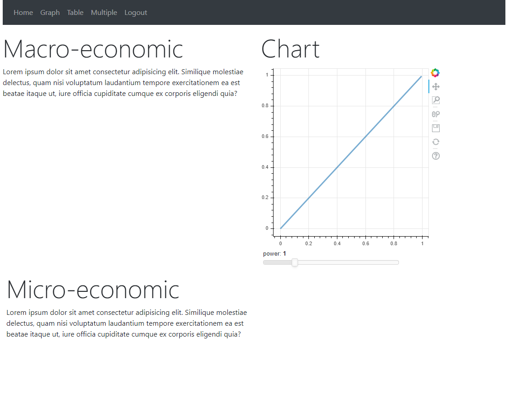
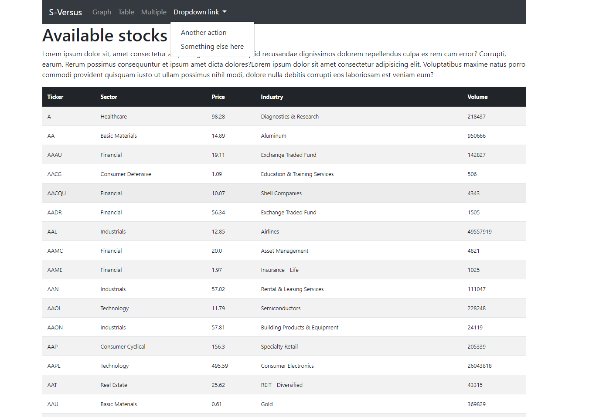
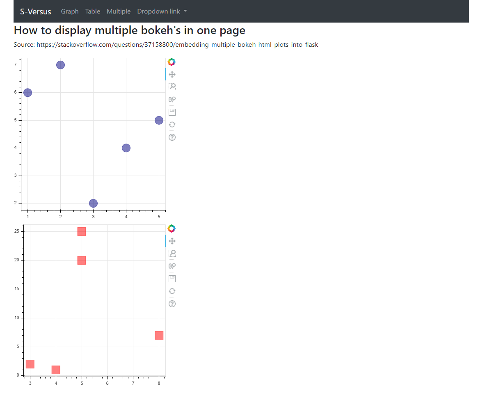

This is my first Flask project (Python, Bootstrap, HTML, CSS,...). The aim is to build a web app that connects to different API's. 
It will gather data from diverse web sources, synthesize and display the competitive arenas for every chosen stock.
The app is connected to various sqlite databases.
The app integrates a user authentication procedure.


<h4> Command to create virtual env (VS code, Ubuntu 20) </h4>
<p>In <strong>Python</strong> command line:</p>

```
python3 -m venv .sversus
```

<h4> Commands to initiate DB's and apply models</h4>

Setting env variable first

```
$env:FLASK_APP = "webapp"
``` 

```
flask db init
flask db migrate -m "some message"
flask db upgrade
```


<h4> To be implemented </h4>

<ul>
    <li>Page with macro-economic information (bokeh figures)</li>
    <li>Connect DB to external API to gather economic data</li>
    <li>Containerize automated web scraping process, deploy to AWS lambda, and link it to the website through an API</li>
</ul>







<h4>Personnal issues encountered and turnaroud:</h4>

<p>https://stackoverflow.com/questions/57018186/cant-activate-environment-from-visual-studio-code</p>

<ul>
	<li>ctrl + shift +p find the settings.json, append two rows: "python.terminal.activateEnvironment": true, "terminal.integrated.shell.windows": "C:\WINDOWS\System32\cmd.exe",</li>
	<li>choose to run the task in the terminal</li>
</ul>
