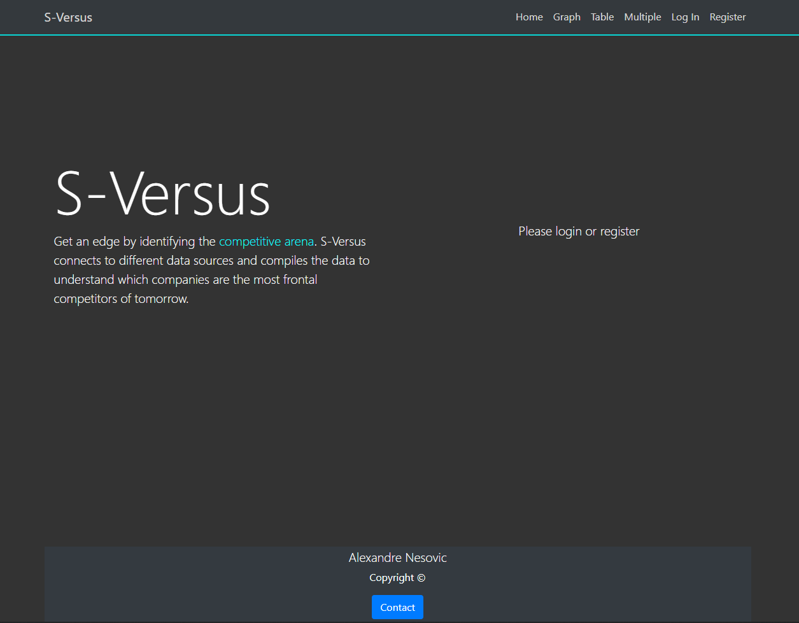
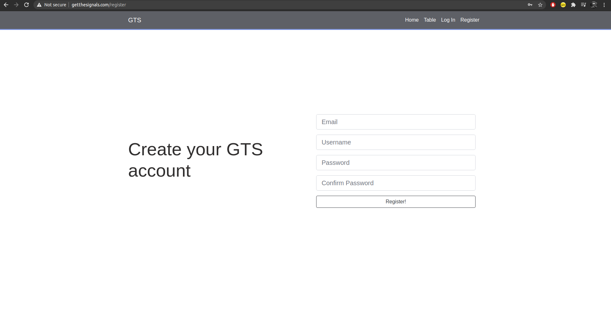
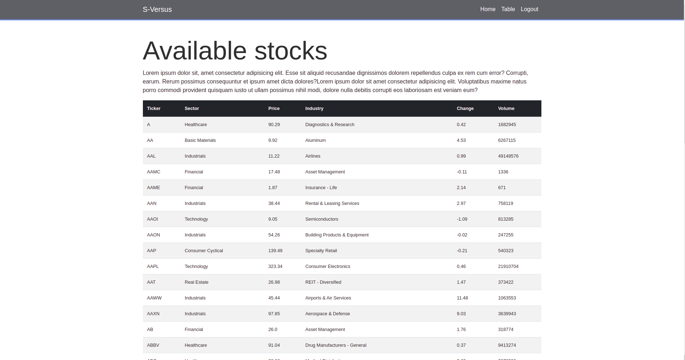
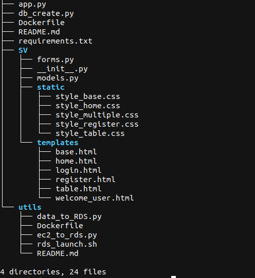

This is my first Flask project (Python, Bootstrap, HTML, CSS,...). The aim is to build a web app that connects to different API's. 
It will gather data from diverse web sources, synthesize and display the competitive arenas for every chosen stock.
The app is connected to various sqlite databases.
The app integrates a user authentication procedure.


<h4> Command to create virtual env (VS code, Ubuntu 20) </h4>
<p>In <strong>project root dir</strong> open command line:</p>

```
python3 -m venv .sversus
source .sversus/bin/activate
```

To initiate db (cutover), run:

```python3 db_create.py```

<h4> To be implemented </h4>

<ul>
    <li>Page with macro-economic information</li>
    <li>Connect DB to external API to gather economic data</li>
    <li>Detect all minimas for a chosen stock and give the ability to download a csv with flagged positions</li>
    <li>Detect double & tripple bottoms & tops</li>
</ul>





<h4> Directory tree: </h4>




<h4>(Windows)Personnal issues encountered and turnaroud:</h4>

<p>https://stackoverflow.com/questions/57018186/cant-activate-environment-from-visual-studio-code</p>

<ul>
	<li>ctrl + shift +p find the settings.json, append two rows: "python.terminal.activateEnvironment": true, "terminal.integrated.shell.windows": "C:\WINDOWS\System32\cmd.exe",</li>
	<li>choose to run the task in the terminal</li>
</ul>

<h4> Dockerization of the app </h4> </br>
In the app folder, run the following command: </br>
<code>docker run -it --name signalnoise -p 5000:5000 -v ${PWD}:/app python:3.7 bash</code>
</br>
<code>pip install -r requirements.txt</code>
</br>
</br>
Start specific container after exit: </br>
<code>docker start `docker ps -a -q --filter "name=signalnoise"`</code>
</br>
To get into a Docker container's shell:</br>
<code>docker exec -it signalnoise bash</code>
</br>
Stop all containers:
<code>docker stop $(docker ps -aq)</code></br>
</br>


Building the image:</br>
<code>docker build -t signalnoise .</code>
</br>
Running the image:</br>
<code>docker run -e aws_db_endpoint='<DNS>' -e aws_db_pass='<password>' -e aws_db_user='<password>' -p 5000:5000 signalnoise</code>
</br>
</br>
Other useful instructions:</br>
<code>docker container ls</code></br>
<code>docker image ls</code></br>

<h4> General considrations about Docker</h4>
<ul>
<li>A Dockerfile is a recipe for creating Docker images</li>
<li>A Docker image gets built by running a Docker command (which uses that Dockerfile)</li>
<li>A Docker container is a running instance of a Docker image</li>
</ul>
</br>

<h5> Regarding the AWS deployment, to zip the new versions to upload</h5>
Inside the root directory run the following command:</br>
<code>zip -r package.zip * .ebextensions</code></br>

To debug static files issue (css):</br>
https://stackoverflow.com/questions/15077489/static-assets-dont-show-up-for-flask-on-elastic-beanstalk
</br>

Create following foler in root dir of the app: </br>
```.ebextensions/python.config```</br>
Add:</br>
<code>
option_settings:</code></br>
<code>  - namespace: aws:elasticbeanstalk:container:python</code></br>
    <code>option_name: StaticFiles</code></br>
    <code>value: /static/=static/</code>
